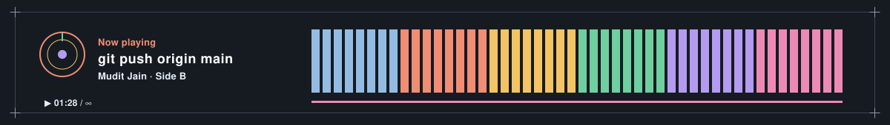

  

<b>I build agentic AI systems and distributed backends, and I've shipped secure BootROM firmware at NXP.</b>

### `01` &nbsp;Flagship: RoadRunner Transport

- $\color{#4fae82}{\textsf{\textbf{8 Go microservices}}}$ over gRPC behind a REST API gateway. MySQL for transactional inventory, MongoDB for schema-variant catalog data.
- $\color{#9a7fd4}{\textsf{\textbf{One saga, three concurrency models:}}}$ pessimistic row locks, quota-based waitlists and external-provider holds, with automatic compensation *(refund → release → cancel)*.
- $\color{#e07a5f}{\textsf{\textbf{Zero double-bookings}}}$ with 100 goroutines contending for one seat under `-race`.
- $\color{#e0a83e}{\textsf{\textbf{MySQL at scale}}}$ (~5.7M seats, ~20M events): covering index cut scanned rows ~47%; monthly partitioning took a date-range query from 9.75s → 2.75s.
- $\color{#6a93bd}{\textsf{\textbf{Exactly-once}}}$ via transactional outbox + idempotent Kafka consumers; Prometheus, OpenTelemetry and per-provider circuit breakers.

### `02` &nbsp;More projects

### `03` &nbsp;Experience

- $\color{#e07a5f}{\textsf{\textbf{NXP Semiconductors}}}$ · Embedded Software Engineer Intern. BootROM firmware for secure SoCs in C and Assembly; a one-click Python GUI wired into Jenkins CI/CD saved 7 days of manual effort and raised testing efficiency 30%.
- $\color{#e0a83e}{\textsf{\textbf{National Informatics Centre}}}$ · Intern. A unified multi-model AI cybersecurity platform (−35% scan latency); a LoRA/QLoRA fine-tuned SLM with 30% higher accuracy at 60% lower training cost, served at <200ms.

### `04` &nbsp;Stack

| Purpose | Tools |
| :-- | :-- |
| **Languages** |  |
| **AI / ML** |      |
| **Backend** |  |
| **Cloud & infra** |  |
| **Data** |    |

### `05` &nbsp;Research & wins

<b>More about me</b>

 

- $\color{#9a7fd4}{\textsf{\textbf{M.Tech Software Engineering}}}$ at DTU (CGPA 8.85); B.Tech CSE at Gautam Buddha University (CGPA 8.46).
- $\color{#4fae82}{\textsf{\textbf{Teaching Assistant}}}$ during my Masters; led the TechEdge club, running competitions for 100+ schools.
- Open-source contributor in $\color{#6a93bd}{\textsf{\textbf{GSSOC 2025}}}$.
- Volunteer with $\color{#e07a5f}{\textsf{\textbf{AASMAAN Foundation}}}$, teaching underprivileged children.

### `06` &nbsp;Contact

  
  
  
  

<a href="#top">Back to top ↑</a>

